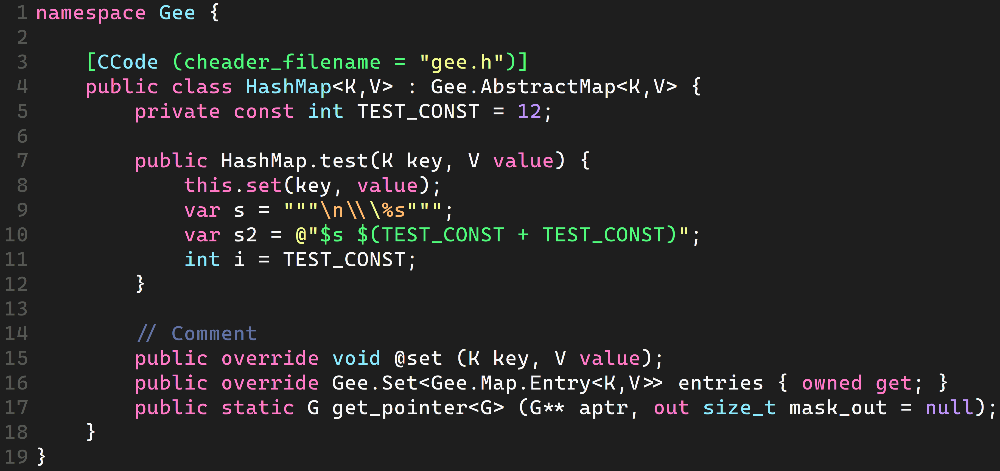
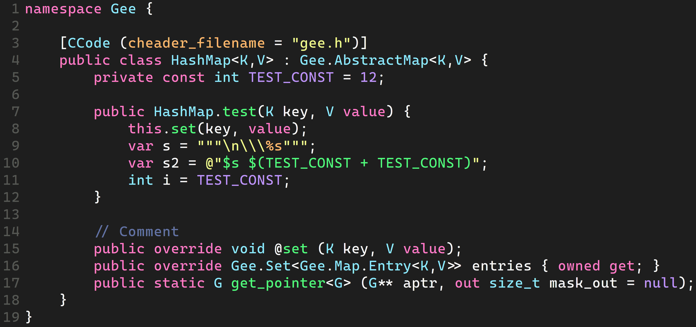

# Improved Languages
This repository contains improved languages for [GtkSourceView](https://wiki.gnome.org/Projects/GtkSourceView)

## Installation
Run `install.sh` script in terminal and select language to install  
Or copy specific .lang file to `~/.local/share/gtksourceview-4/language-specs`

### Improved languages
- [x] Vala

### Comparisons with standard languages
- **Vala**
  - Standart 
  - Improved 
